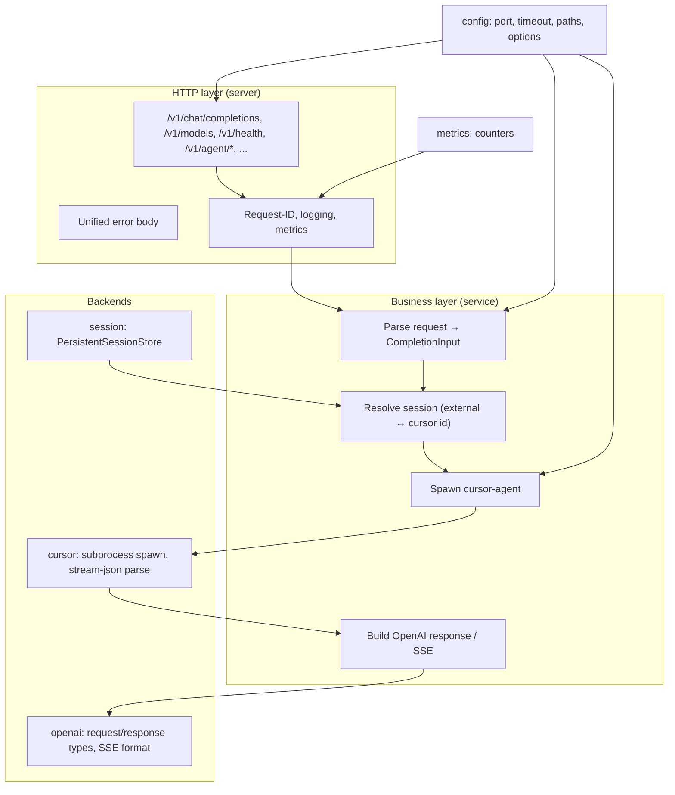
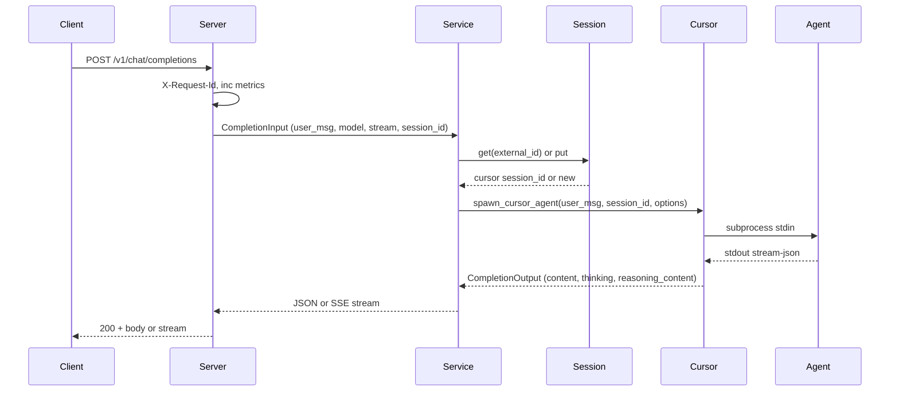

# Architecture (English)

## Overview

cursor-brain is an **OpenAI-compatible HTTP service** backed by Cursor Agent. Stack: Rust, Axum, tokio.

- **Layers**: HTTP (server) → business (service) → cursor subprocess (cursor) + session (session) + OpenAI types (openai); config and metrics are shared.
- **Data flow**: Request → middleware (X-Request-Id, logging, metrics) → route → service (session resolve, spawn cursor-agent, stream or buffered) → response.

## Component layers

Mermaid source

## Request flow (chat completion)

Mermaid source

## Module boundaries

| Module      | Role                                                                                                      |
| ----------- | --------------------------------------------------------------------------------------------------------- |
| **main**    | Entry: load config, ensure workspace dir, write PID, start server.                                        |
| **config**  | Single source of defaults; load from `~/.cursor-brain/config.json` only; write default file on first run. |
| **server**  | HTTP: routes, error body, middleware. Uses service, session, cursor, config, metrics.                     |
| **service** | Business: build CompletionInput, resolve session, spawn via cursor, build OpenAI response.                |
| **cursor**  | Subprocess: spawn cursor-agent, stream-json parsing, list-models, version, agent subcommands.             |
| **session** | Storage: external session id ↔ cursor session_id; persisted to `~/.cursor-brain/sessions.json`.           |
| **openai**  | Types and formatting only: ChatCompletionRequest, build_completion_response, SSE chunks.                  |
| **metrics** | In-memory counters for GET /v1/metrics.                                                                   |

## See also

- [DESIGN.md](DESIGN.md) — design decisions, defaults, PID, platform support.
- [openai-protocol.md](openai-protocol.md) — API alignment, `content` vs `reasoning_content`.
- [tutorial.en.md](tutorial.en.md) — quick start, configuration, API usage, deployment.
