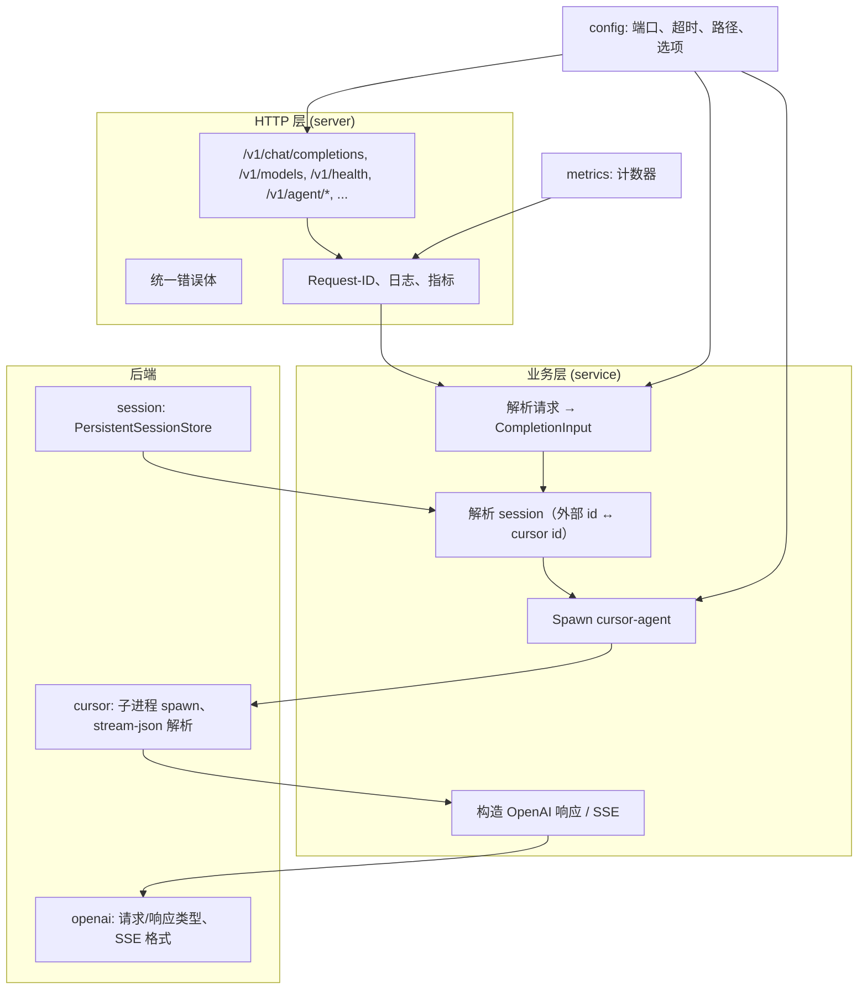
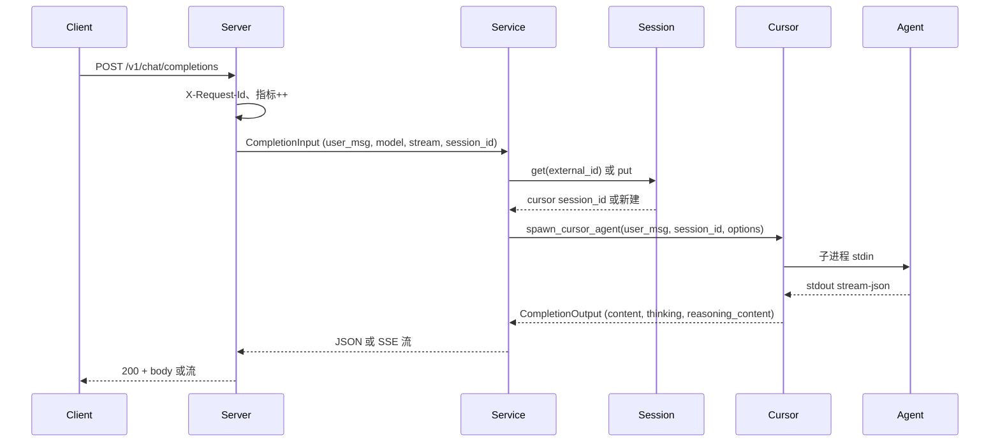

# 架构说明（中文）

## 概览

cursor-brain 是**通用 OpenAI 兼容 HTTP 服务**，以 Cursor Agent 为推理后端。技术栈：Rust、Axum、tokio。

- **分层**：HTTP（server）→ 业务（service）→ cursor 子进程（cursor）+ 会话存储（session）+ OpenAI 类型（openai）；config 与 metrics 贯穿。
- **数据流**：请求 → 中间件（X-Request-Id、日志、指标）→ 路由 → service（解析 session、spawn cursor-agent、流式或缓冲）→ 响应。

## 组件分层

Mermaid 源码

## 请求流（聊天补全）

Mermaid 源码

## 模块边界

| 模块        | 职责                                                                                  |
| ----------- | ------------------------------------------------------------------------------------- |
| **main**    | 入口：加载配置、确保 workspace 目录、写 PID、启动 HTTP 服务。                         |
| **config**  | 默认值唯一来源；仅从 `~/.cursor-brain/config.json` 读取；首次运行写默认文件。         |
| **server**  | HTTP：路由、错误体、中间件。依赖 service、session、cursor、config、metrics。          |
| **service** | 业务：构造 CompletionInput、解析 session、通过 cursor spawn、构造 OpenAI 响应。       |
| **cursor**  | 子进程：spawn cursor-agent、stream-json 解析、list-models、version、agent 子命令。    |
| **session** | 存储：外部 session id ↔ cursor session_id；持久化到 `~/.cursor-brain/sessions.json`。 |
| **openai**  | 仅类型与格式化：ChatCompletionRequest、build_completion_response、SSE 块。            |
| **metrics** | 内存计数器，供 GET /v1/metrics。                                                      |

## 参见

- [DESIGN.md](DESIGN.md) — 设计决策、默认值、PID、平台支持。
- [openai-protocol.md](openai-protocol.md) — API 对齐、`content` 与 `reasoning_content`。
- [tutorial.zh.md](tutorial.zh.md) — 快速开始、配置、API 用法、部署。
